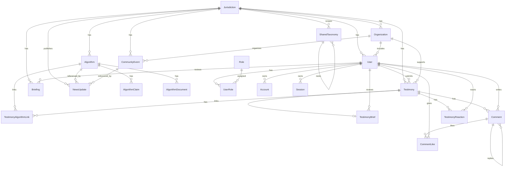

# Database map

This is a simple map for the current Prisma schema and where the main fields show up in the site.

## ERD

`VerificationToken` is a standalone Auth.js-compatible token table used for email/token verification flows.

## UI mapping

| Website area | Database fields |
| --- | --- |
| Algorithm cards | `Algorithm.name`, `description`, `useCase`, `location`, `status`, testimony count from `TestimonyAlgorithmLink` |
| Algorithm detail | `Algorithm.purpose`, `dataUsed`, `decisionType`, `agencyName`, `yearIntroduced`, `yearDeployed` |
| Official claims | `AlgorithmClaim.claimText`, `claimSource`, `claimDate` |
| Documents | `AlgorithmDocument.title`, `sourceUrl`, `storageUrl`, `rawText`, `tokenizedText` |
| Story list | `Testimony.title`, `summary`, `affectedDomain`, `submittedAt`, `moderationStatus` |
| Story detail summary | `TestimonyBrief.summary`, `keyExcerpts` |
| Story reactions | `TestimonyReaction.reactionType` for `EYE_OPENING` and `SUPPORT` |
| Threaded comments | `Comment.content`, `parentCommentId`, `moderationStatus`; likes from `CommentLike` |
| Comment like buttons | `CommentLike.commentId`, `CommentLike.userId` |
| Admin dashboard | counts from `Algorithm`, `Testimony`, `Comment`, `User` |
| Admin users | `User.email`, `User.name`, roles from `Role` and `UserRole` |
| Community events | `CommunityEvent.title`, `description`, `date`, `location`, `registrationUrl` |
| Organizations manager | `Organization.name`, `slug`, `contactEmail`, `websiteUrl`, `role`, `isActive` |
| Auth/session foundation | `User`, `Role`, `UserRole`, `Account`, `Session`, `VerificationToken` |
| News/update surfaces | `NewsUpdate.title`, `body`, `updateType`, `relatedAlgorithmId`, `relatedEventId`, `publishedAt` |
| Shared filters/taxonomy | `SharedTaxonomy.category`, `label`, `description`, `parentId`, `jurisdictionId` |
