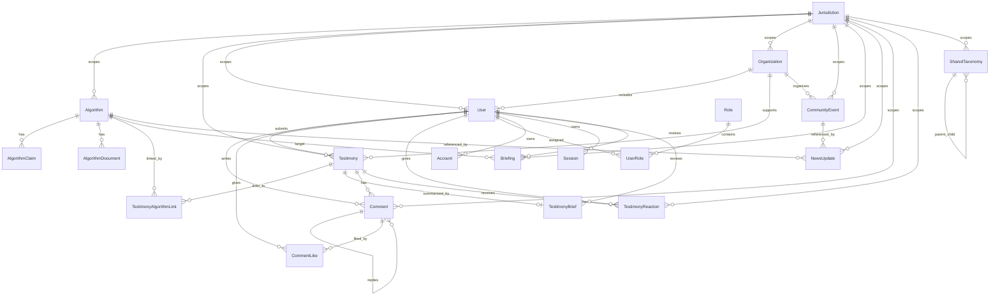

# Database Architecture and UI Field Map

This document covers Week 3 Part 1.5: the visual database diagram and the field-level map between Prisma tables and the website.

## Visual ERD

Open the SVG diagram in the deployed app or from the repository:

- `/database-erd.svg`
- `public/database-erd.svg`

The diagram shows the production PostgreSQL schema used by the Next.js app on Vercel and Neon. Dashed orange lines indicate jurisdiction scoping. Solid lines indicate foreign-key relationships.

## Mermaid ERD

`VerificationToken` is a standalone Auth-compatible table for email/token verification. It does not need a foreign key to render the current application.

## UI Mapping

| Website area | Source table | Fields displayed or used |
| --- | --- | --- |
| Home stats | `Algorithm`, `Testimony`, `CommunityEvent` | Counts filtered by `jurisdictionId` |
| Home featured algorithms | `Algorithm`, `TestimonyAlgorithmLink` | `name`, `slug`, `description`, `status`, `useCase`, `location`, testimony count |
| Home community voices | `Testimony`, `Comment`, `TestimonyReaction` | `id`, `title`, `summary`, reaction count, comment count |
| Home events panel | `CommunityEvent`, `Organization` | `title`, `date`, `organizer.name`, `location` |
| Global navigation | `Session`, `User`, `UserRole` | Determines current user and admin access |
| Algorithm registry filters | `Algorithm` | `name`, `description`, `agencyName`, `useCase`, `location`, `status`, `impactLevel`, `updatedAt` |
| Algorithm registry cards | `Algorithm`, `TestimonyAlgorithmLink` | `slug`, `name`, `description`, `agencyName`, `useCase`, `location`, `status`, testimony count |
| Algorithm detail header | `Algorithm` | `name`, `description`, `status`, `impactLevel`, `agencyName`, `useCase`, `location`, `updatedAt` |
| Algorithm detail system fields | `Algorithm` | `purpose`, `dataUsed`, `decisionType`, `agencyType`, `yearIntroduced`, `yearDeployed`, `currentVersion` |
| Official claims section | `AlgorithmClaim` | `claimText`, `claimSource`, `claimDate` |
| Documents section | `AlgorithmDocument` | `title`, `sourceType`, `sourceUrl`, `storageUrl`, `uploadedAt` |
| Linked testimony section | `TestimonyAlgorithmLink`, `Testimony` | `testimonyId`, `algorithmId`, `linkType`, `confidence`, approved testimony `title`, `summary` |
| Stories list filters | `Testimony` | `title`, `summary`, `narrativeText`, `affectedDomain`, `city`, `moderationStatus` |
| Stories list rows | `Testimony`, `Comment`, `TestimonyReaction` | `id`, `title`, `summary`, `city`, `affectedDomain`, `submittedAt`, reaction count, comment count |
| Story detail | `Testimony`, `TestimonyBrief`, `TestimonyAlgorithmLink` | `title`, `summary`, `narrativeText`, `city`, `affectedDomain`, `submittedAt`, `brief.summary`, linked algorithm names |
| Story reaction buttons | `TestimonyReaction` | `reactionType`, `testimonyId`, `userId`; supports `EYE_OPENING` and `SUPPORT` |
| Threaded comments | `Comment`, `CommentLike`, `User` | `content`, `authorName`, `parentCommentId`, `moderationStatus`, `user.name`, like count |
| Submit testimony form | `Testimony`, `TestimonyAlgorithmLink`, `User` | Creates `title`, `city`, `narrativeText`, `summary`, `selfReportedImpact`, `userId`, optional `algorithmId` link, `moderationStatus=PENDING` |
| Community events page | `CommunityEvent`, `Organization` | `title`, `description`, `eventType`, `date`, `location`, `isVirtual`, `registrationUrl`, `organizer.name` |
| Login and signup | `User`, `Role`, `UserRole`, `Session` | `email`, `name`, default `COMMUNITY_MEMBER` role, `sessionToken`, `expires` |
| Admin dashboard | `Algorithm`, `Testimony`, `Comment`, `User` | Counts for algorithms, pending testimonies, pending comments, users |
| Admin algorithm manager | `Algorithm`, `AlgorithmClaim` | Create/update/delete registry fields and official claims |
| Admin event manager | `CommunityEvent`, `Organization` | Create/update/delete event fields and organizer link |
| Admin organization manager | `Organization` | `name`, `slug`, `description`, `contactEmail`, `websiteUrl`, `role`, `isActive` |
| Admin testimony queue | `Testimony`, `User` | Pending/flagged/rejected/approved testimony review with moderation actions |
| Admin comment queue | `Comment`, `Testimony`, `User` | Pending comment review with approve/reject/flag actions |
| Admin user manager | `User`, `Role`, `UserRole` | `email`, `name`, assigned role; admin can update role assignment |
| API scoping | Every jurisdiction-scoped table | `jurisdictionId` from `JURISDICTION_ID` environment variable |
| Shared taxonomy | `SharedTaxonomy` | `category`, `label`, `description`, `parentId`, optional `jurisdictionId` |

## Notes

- `Story` from the prototype is represented as `Testimony` in Prisma.
- Prototype story reactions and comments are now stored in `TestimonyReaction`, `Comment`, and `CommentLike`.
- The app uses the same schema locally and on Vercel; the active database is selected by `DATABASE_URL`.
- The current deployment is scoped to `JURISDICTION_ID=pittsburgh`.
